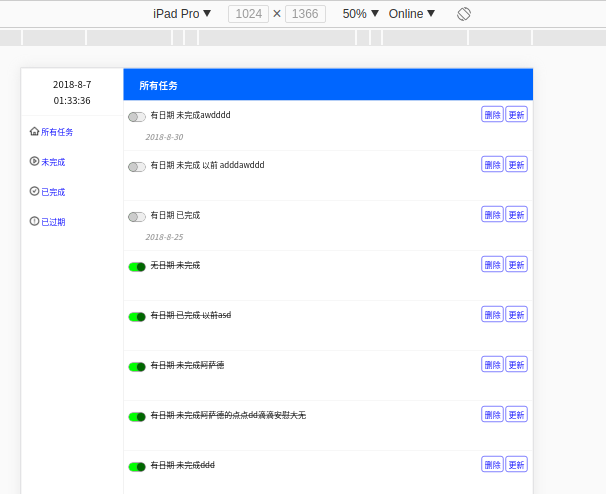
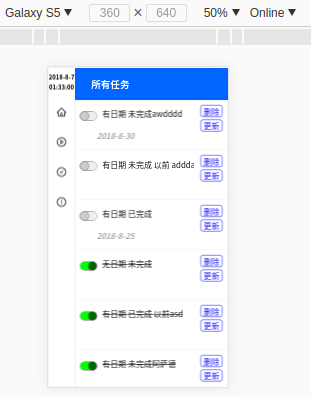

### 
这是一个页面简洁且的离线web任务管理工具

### 
同时是一个基于原生前端语言的SPA学习项目

### [尝试一下](https://zaqmjuop.github.io/todoist/)
#### 支持多种分辨率
Desktop界面

Mobile界面 

***
### 该学习项目介绍: 基于原生HTML CSS JavaScript 的参照MVC设计模式的代码架构
### 核心文件目录介绍
* /assets 主目录
  * /styles CSS目录
  * /scripts JavaScript目录
  * /images 图片目录
  * /template 视图模板目录
***
### 参考MVC设计模式介绍
* Model层 基于对web浏览器离线数据库API indexeddb的封装库 [ArrayStorage](https://github.com/zaqmjuop/arraystorage) 进行二次封装model
  * /assets/models.js Model主文件
* View层 在html文件中编写组件的结构并使用CSS scoped编写组件的样式
  * /template
    * /router.html 路由控制组件
    * /welcome.html App主体 
    * /leftMenu.html 左侧菜单栏
    * /missionCard.html 右侧清单主体
    * /missionListItem.html 任务条目
* Controller 层
  * /assets/scripts/components 控制器和组件主要目录
    * /component.js Controller核心控制文件
    * /example.js 组件Controller demo
    * /main.js 执行文件

