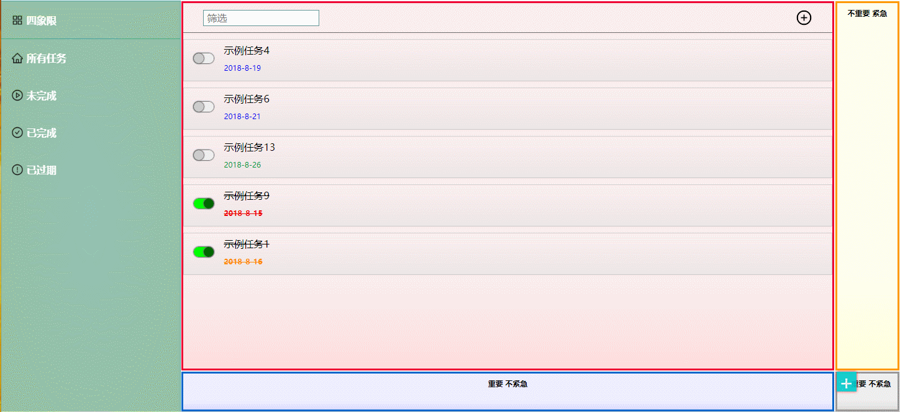

### 
这是一个页面简洁且的离线web任务管理工具

### 
同时是一个基于原生前端语言的SPA学习项目

### 功能：任务清单的增删查改
### 界面预览  [尝试一下](https://zaqmjuop.github.io/todoist/)

***
### 该学习项目介绍: 采用了基于原生HTML CSS JavaScript 的参照MVC设计模式的代码架构
#### 开发过程中产生的一系列问题和最后选择参照MVC设计模式的原因
* Q : dom操作过多导致元素之间联系过于密切，牵一发动全身
  * A : 封装全局作用域组件 [datepicker.js](https://github.com/zaqmjuop/datepicker) 将页面元素插件化
* Q ： 即使封装了仿JQuery的操作库[dom.js](https://github.com/zaqmjuop/todoist/blob/master/assets/scripts/dom.js)，但仍需要在js中大量的拼接元素标签，使js和html的界限有些模糊，由于html元素写在字符串中可读性不强
  * A : 从DOM拼接改为[ajax.js](https://github.com/zaqmjuop/todoist/blob/master/assets/scripts/ajax.js)请求DOM，将局部元素也写在html文件中，有编辑器原生的高亮和代码提示，具有可读性
  * 由于页面已经从一个html拆分成了多个html，索性把DOM操作也拆分开,产生了[component.js](https://github.com/zaqmjuop/todoist/blob/master/assets/scripts/components/component.js)，实例化的组件也仿造DOM的操作方式
* Q ： 因为CSS过多而产生作用域问题
  * A : html5有css scoped但兼容性很差，所以自行处理了css scoped兼容性并封装在了[component.js](https://github.com/zaqmjuop/todoist/blob/master/assets/scripts/components/component.js)中，支持 @media 和 @keyframes
* Q ： 组件中进行大量对indexedDB的操作，而且由于indexedDB的事务的生命周期特性导致难于调试
  * A : 封装indexedDB操作库并删除了大量不必要的操作，精简成了只有8个API的indexedDB操作库[ArrayStorage](https://github.com/zaqmjuop/arraystorage)，并对库进行二次定制封装成[mission.js](https://github.com/zaqmjuop/todoist/blob/master/assets/scripts/model/mission.js)，在组件内调用封装好的API,从而将对数据库的详细操作从组件内抽离出来，使组件的脚本逻辑更纯粹清晰
***
### 文件目录介绍
* /assets 主目录
  * /styles CSS目录
  * /scripts JavaScript目录
  * /images 图片目录
  * /template 视图模板目录
### 主要文件介绍
* Model层 基于对web浏览器离线数据库API indexedDB的封装库 [ArrayStorage](https://github.com/zaqmjuop/arraystorage) 进行二次封装model
  * /assets/models/
    * [mission.js](https://github.com/zaqmjuop/todoist/blob/master/assets/scripts/model/mission.js) Mission model
* View层 在html文件中编写组件的结构并使用CSS scoped编写组件的样式
  * /template/
    * [welcome.html](https://github.com/zaqmjuop/todoist/blob/master/assets/templates/welcome.html) App主体的视图模板
* Controller 层
  * /assets/scripts/components/ 控制器和组件主要目录
    * [component.js](https://github.com/zaqmjuop/todoist/blob/master/assets/scripts/components/component.js) 组件类，Controller核心控制文件
    * [welcome.js](https://github.com/zaqmjuop/todoist/blob/master/assets/scripts/components/welcome.js) App主体组件的脚本
* Module 层
  * /assets/scripts/
    * [ajax.js](https://github.com/zaqmjuop/todoist/blob/master/assets/scripts/ajax.js) ajax封装
    * [dom.js](https://github.com/zaqmjuop/todoist/blob/master/assets/scripts/dom.js) 仿JQuery API 的DOM操作类
  * npm import module
    * [ArrayStorage](https://github.com/zaqmjuop/arraystorage) indexedDB封装库
    * /assets/scripts/lib/[datepicker.js](https://github.com/zaqmjuop/datepicker) 时间选择器插件 

todo 
  * 抽取component.js并作为库开发 (不过好像没什么意义)
